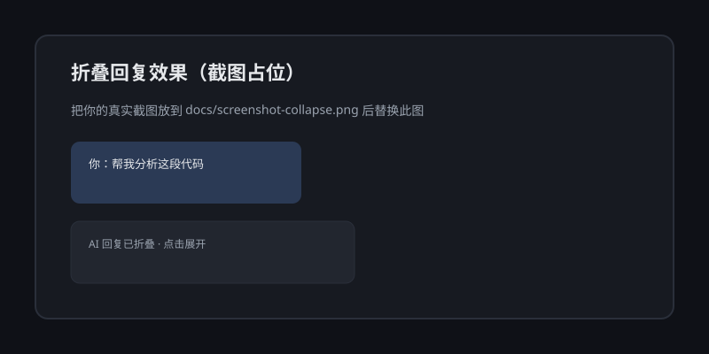
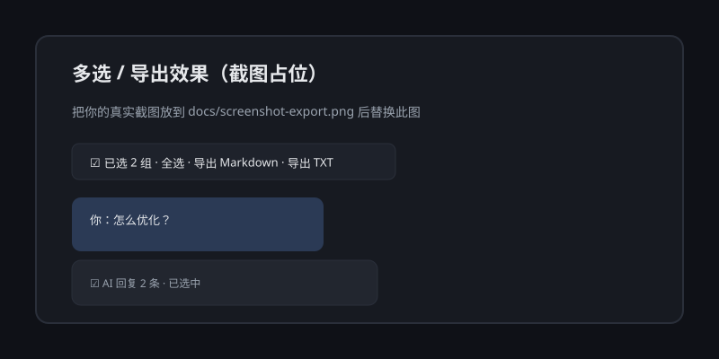

# dsh-chat-tools

[](https://github.com/cfy209/dsh-chat-tools/stargazers)
[](https://github.com/cfy209/dsh-chat-tools/releases)
[](LICENSE)
[](https://github.com/cfy209/dsh-chat-tools)

一个面向 **DeepSeek Harness** 的可插拔客户端插件，让长对话更易浏览、更易保存：

- **折叠回复（Zhihu 风格）**：每一轮 AI 回复完成后，可以折叠成一行，快速往上翻找之前的对话。
- **一键折叠全部 / 展开全部**：在会话头部一键收起或展开当前会话所有已完成轮次。
- **多选 / 全选**：进入选择模式后，按“轮”勾选对话；支持一键全选当前可见的已完成轮次。
- **导出 Markdown / TXT**：把选中的对话批量保存为本地 `.md` 或 `.txt` 文件。

所有功能都运行在 Harness 的 Web UI 客户端，不需要改后端，也不需要改 Harness 本体。

---

## 为什么做这个插件

用 DeepSeek Harness 久了之后，我发现一个很真实的痛点：

> 我明明只问了一句话，AI 却可能回我很长一大段，甚至中间还夹着工具调用、命令输出、多步推理。等我想往上翻找“我上一句到底问了什么”的时候，整个页面已经变得非常长，滚动起来很累。

知乎的“收起回答”给了我灵感：如果每一轮 AI 回复也能折叠成一行，我就能像翻目录一样快速定位到想看的对话。

后来又发现，很多时候我想把某几轮有价值的对话保存下来，但手动复制又容易漏、格式也乱。于是我把“多选 + 导出 Markdown/TXT”也一起做进了这个插件。

这就是 **dsh-chat-tools** 的由来：让 DSH 的长对话更清爽、更可保存。

---

## 截图预览

> 下面是占位图。如果你有真实截图，请放到 `docs/` 并替换下面的图片链接（推荐 `screenshot-collapse.png` / `screenshot-export.png`）。

| 折叠回复 | 多选与导出 |
|---|---|
|  |  |

在线交互演示（纯前端模拟）：

👉 **[打开 dsh-chat-tools 在线演示](https://cfy209.github.io/dsh-chat-tools/)**

---

## 功能演示

| 状态 | 说明 |
|---|---|
| 默认 | 每轮 AI 回复底部有一个「折叠回复」按钮 |
| 折叠后 | 该轮 AI 内容收起，只保留你的问题 + 一行「AI 回复已折叠」和「展开回复」 |
| 选择模式 | 点击会话头部「选择」，每轮会出现复选框，头部出现「全选 / 清空 / 导出」 |
| 导出 | 导出当前选中轮次的用户消息和 AI 文本，按对话顺序输出 |

---

## 安装

### 方式一：通过 GitHub Release 安装（推荐）

```bash
dsh plugin --profile <name> add https://github.com/cfy209/dsh-chat-tools/releases/download/v0.1.0/dsh-external-dsh-chat-tools-0.1.0.tgz
```

也可以到 [Releases 页面](https://github.com/cfy209/dsh-chat-tools/releases) 下载 `dsh-external-dsh-chat-tools-0.1.0.tgz` 后本地安装。

### 方式二：作为本地插件注入（开发/试用）

```bash
# 在 DSH 注入器环境内
dev_build_plugin {"dir": "D:/path/to/dsh-chat-tools"}
dev_inject_plugin {"dir": "D:/path/to/dsh-chat-tools"}
```

### 方式三：作为 npm/GitHub 包安装

```bash
dsh plugin --profile <name> add @dsh-external/dsh-chat-tools
```

或者手动在 profile 的 `package.json` 中增加依赖，并在 `dsh.profile.bundles` 中加入包名；包内自带 `cordis.patch.yml`，启动时会自动挂载。

---

## 使用

1. 打开任意会话，AI 回复完成后，在回复底部点击 **「折叠回复」**。
2. 想快速收起整个会话时，点击会话头部 **「折叠全部」**；需要恢复时点 **「展开全部」**。
3. 需要保存时，点击会话头部 **「选择」**。
4. 勾选要导出的轮次，或点 **「全选」**。
5. 点击 **「导出 Markdown」** 或 **「导出 TXT」**，浏览器会下载文件。

---

## 开发

```bash
# 安装依赖
pnpm install

# 构建 host + client
pnpm build

# 只构建 client（tsdown）
pnpm build:client

# 类型检查（仅 host；client 由 tsdown 打包）
pnpm typecheck
```

### 目录结构

```
dsh-chat-tools/
├── src/
│   ├── index.ts              # host half（无操作，仅占位）
│   └── client/
│       ├── index.ts          # client 插件入口：slot 注册 + 样式 + 多语言
│       ├── store.ts          # 选择/折叠状态
│       ├── export.ts         # Markdown/TXT 导出逻辑
│       └── components.tsx    # 头部工具栏 + 每轮折叠/复选框
├── docs/
│   ├── index.html            # GitHub Pages 在线演示（折叠 + 多选 + 导出）
│   ├── screenshot-collapse.svg
│   └── screenshot-export.svg
├── cordis.patch.yml          # bundle 挂载补丁
├── package.json
└── README.md
```

---

## 实现原理

- 使用 DSH 标准 client slot：
  - `conversation.session.header.utilities` → 头部「选择/导出」工具栏
  - `conversation.chat.assistant-actions` → 每条已完成 AI 回复旁的折叠按钮和复选框（list 槽，可与其它插件共存）
- 折叠通过 DOM 操作隐藏当前轮内 AI/工具/命令节点，保留用户消息。
- 导出通过 `useSession` 读取当前已加载的对话快照，按 `chat.locations.getTurn(turn)` 还原每一轮的消息顺序。

---

## 限制

- 只能选择**当前已加载**的对话轮次（即页面上已经渲染出来的内容）；未加载的历史需要先滚动加载。
- 导出内容只包含用户消息和 AI 文本，不包含工具调用详情、命令输出等内部卡片。
- 折叠/选择状态不持久化，刷新页面后恢复默认。

---

## License

MIT
